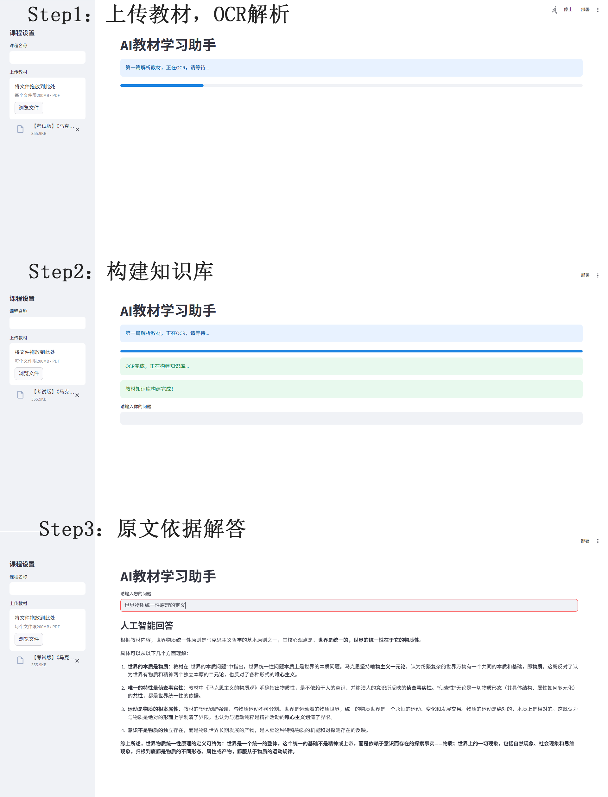

# AI Textbook Copilot (RAG)

一个基于 RAG（Retrieval-Augmented Generation）的 AI 教材问答系统
支持 PDF 教材解析、OCR 识别、语义检索，并结合大模型生成高质量答案

---

## 项目功能

* 上传 PDF 教材
* 自动 OCR 识别（PaddleOCR）
* 文本切分与向量化
* 构建向量数据库（FAISS）
* 基于语义检索的智能问答（RAG）
* 使用大模型生成上下文相关回答（DeepSeek）

---

## 技术架构

PDF教材
→ OCR识别（PaddleOCR）
→ 文本切分（LangChain）
→ 向量化（text2vec）
→ 向量数据库（FAISS）
→ 语义检索（Top-K）
→ LLM生成回答（DeepSeek）

---

## 技术栈

* Python
* Streamlit
* LangChain
* PaddleOCR
* FAISS
* text2vec
* DeepSeek API

---

## 项目演示



---

## 快速开始

### 1. 克隆项目

```bash
git clone https://github.com/Selene225/ai-textbook-copilot.git
cd ai-textbook-copilot
```

### 2. 安装依赖

```bash
pip install -r requirements.txt
```

### 3. 配置 API Key

#### Linux / Mac

```bash
export DEEPSEEK_API_KEY=your_api_key
```

#### Windows

```bash
set DEEPSEEK_API_KEY=your_api_key
```

### 4. 运行项目

```bash
streamlit run app.py
```

---

## 使用流程

1. 上传 PDF 教材
2. 系统自动进行 OCR 解析并构建知识库
3. 输入问题
4. 获取基于教材内容的回答

---

## 项目亮点

* 实现完整 RAG 流程（从数据 → 检索 → 生成）
* 支持 OCR 处理非结构化教材
* 结合向量数据库实现高效语义搜索
* 具备实际应用场景（学习辅助 / 知识问答）

---

## 后续优化方向

* 引入 Rerank 模型提升检索精度
* 增加答案来源定位（引用原文）
* UI 产品化优化
* 支持自动摘要与知识点整理

---

## License

MIT License
